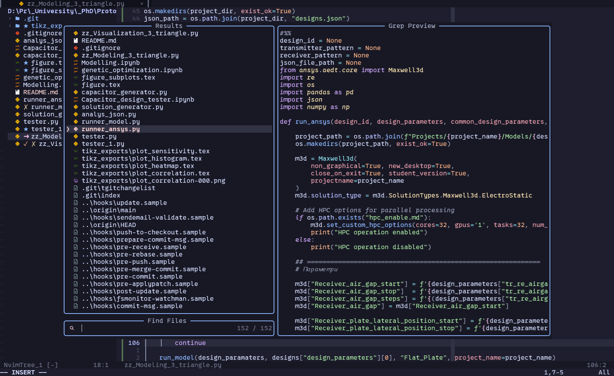

# Neovim Lua Configuration

A modular, plugin-focused Neovim configuration written fully in **Lua**.  This
setup provides modern UI enhancements, LSP support, Git integration,
Treesitter, debugging, file tree navigation, and more. This README describes
the **exact structure and plugins included** in this repository.



---

## Directory Structure

```
nvim/
│
├── init.lua
├─+ core/
│ ├── keymaps.lua
│ ├── options.lua
│ └── plugins.lua
└─+ config/
  ├── autopairs.lua
  ├── barbar.lua
  ├── catppuccin.lua
  ├── cmp.lua
  ├── comment.lua
  ├── conform.lua
  ├── dap.lua
  ├── gitsigns.lua
  ├── indent.lua
  ├── lint.lua
  ├── lsp.lua
  ├── lualine.lua
  ├── mason.lua
  ├── neogit.lua
  ├── nvim-tree.lua
  ├── telescope.lua
  ├── todo-comments.lua
  ├── treesitter.lua
  ├── vimtex.lua
  └── whichkey.lua
```

### **`init.lua`**
Main entry point — sets leader keys and loads core modules and plugin configs.

### **`core/`**
Basic editor configuration:
- **options.lua** — Neovim settings (indentation, UI, behavior)
- **keymaps.lua** — all keybindings
- **plugins.lua** — lazy.nvim plugin list + setup

### **`config/`**
Each plugin has its own standalone configuration module:
- **autopairs.lua** — Auto-close brackets/quotes with cmp integration
- **barbar.lua** — Buffer tabline with navigation keymaps
- **catppuccin.lua** — Catppuccin theme setup
- **cmp.lua** — Autocompletion (nvim-cmp + sources + vsnip)
- **comment.lua** — `gcc`/`gc` comment toggling
- **conform.lua** — Formatter runner (stylua, black, clang-format); `<leader>cf` to format
- **dap.lua** — Debug Adapter Protocol configuration
- **gitsigns.lua** — Git change indicators and hunk keymaps
- **indent.lua** — Indentation guides
- **lint.lua** — Linter runner (flake8, etc.) triggered on save
- **lsp.lua** — LSP server configs (`lua_ls`, `pyright`, `clangd`) and keymaps
- **lualine.lua** — Statusline
- **mason.lua** — Mason installer + mason-lspconfig (ensures servers are installed)
- **neogit.lua** — Neogit Git UI
- **nvim-tree.lua** — File explorer
- **telescope.lua** — Fuzzy finder + extensions
- **todo-comments.lua** — Highlighted TODO/FIXME comments
- **treesitter.lua** — Treesitter syntax + highlighting
- **vimtex.lua** — LaTeX support
- **whichkey.lua** — Keymap helper popup

---

## Included Plugins

### **UI / Appearance**
- **Catppuccin** — modern color theme
- **Lualine** — customizable statusline
- **nvim-web-devicons** — file type icons
- **Barbar.nvim** — buffer tabline with navigation

### **Navigation / Fuzzy Finding**
- **Telescope.nvim** — fuzzy finder for files, commands, LSP, etc.
- **telescope-fzf-native.nvim** — native fzf sorter for Telescope
- **telescope-file-browser.nvim** — file browser extension for Telescope
- **nvim-tree.lua** — sidebar file explorer

### **Editor Enhancements**
- **Treesitter** — syntax tree parsing, highlighting, folding
- **Indent-blankline** — indentation guides
- **Which-key** — displays available keybindings
- **todo-comments.nvim** — highlighted TODO/FIXME/NOTE comments

### **LSP / Completion**
- **mason.nvim** — installs and manages LSP servers, formatters, linters
- **mason-lspconfig.nvim** — bridges mason with nvim-lspconfig
- **nvim-lspconfig** — LSP server configurations (`lua_ls`, `pyright`, `clangd`)
- **nvim-cmp** — autocompletion engine
- **cmp-nvim-lsp** — LSP source for nvim-cmp
- **cmp-buffer** — buffer words source
- **cmp-path** — filesystem path source
- **cmp-cmdline** — command-line completion
- **vim-vsnip** / **cmp-vsnip** — snippet engine and source
- **Wakatime** — programming time tracker

### **Formatting / Linting**
- **conform.nvim** — formatter runner; format on save + `<leader>cf`
- **nvim-lint** — linter runner triggered on save and buffer read

### **Editing**
- **nvim-autopairs** — auto-close brackets and quotes, integrated with nvim-cmp
- **Comment.nvim** — `gcc` (line) / `gc` (motion/visual) comment toggling

### **Debugging**
- **nvim-dap** — Debug Adapter Protocol client
- **nvim-dap-ui** — UI for nvim-dap
- **nvim-dap-virtual-text** — virtual text for DAP

### **Git Integration**
- **Gitsigns.nvim** — diff signs and inline git info
- **Neogit** — Magit-like Git UI
- **git-worktree.nvim** — Git worktree management

### **LaTeX**
- **VimTeX** — full LaTeX editing environment

---

## Keymap Layout

| Prefix | Domain |
|--------|--------|
| `<leader>f*` | Telescope find (files, grep, buffers, todo) |
| `<leader>g*` | Git (neogit, gitsigns operations) |
| `<leader>h*` | Git hunks (stage, undo, reset, preview, blame) |
| `<leader>l*` | LaTeX (VimTeX) |
| `<leader>cf` | Format buffer (conform) |
| `<leader>rn` / `<leader>ca` | LSP rename / code action |
| `<A-,>` / `<A-.>` / `<A-1-9>` | Barbar buffer navigation |
| `F5–F12`, `F3` | DAP step/continue/breakpoint |
| `<C-h/j/k/l>` | Window navigation |
| `<leader>w/q` | Save / quit |

---

## Customization

Add plugins → `core/plugins.lua`

Modify options → `core/options.lua`

Change keymaps → `core/keymaps.lua`

Edit individual plugin settings → `config/*.lua`

The design is fully modular — each plugin lives in its own file.

## Contributing

Pull requests and suggestions are welcome.
This config aims to stay modular, clean, and easy to extend.
