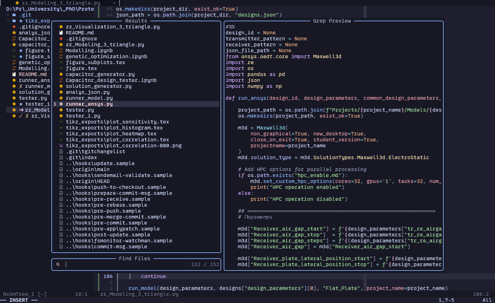

# Neovim Lua Configuration

A modular Neovim configuration written entirely in Lua and managed with
[lazy.nvim](https://github.com/folke/lazy.nvim). It is tuned for C/C++
(host and embedded: STM32, ESP32), Python and LaTeX work, with native LSP,
debugging through DAP, and a full Git workflow.



---

## Features

- **Fast startup** – every plugin is lazy-loaded on an event, command, filetype or key.
- **Native LSP** – uses the Neovim 0.11+ `vim.lsp.config()` / `vim.lsp.enable()` APIs;
  servers are installed automatically by Mason.
- **Embedded-aware C/C++** – clangd is allowed to query the `arm-none-eabi` and
  `xtensa-esp*-elf` toolchains, so cross-compiled projects resolve their system headers.
- **Debugging** – nvim-dap with GDB's built-in DAP mode for host C++, OpenOCD for
  Cortex-M / ESP32 targets, and debugpy for Python.
- **Formatting that respects the project** – clang-format uses a project's
  `.clang-format` when present and falls back to LLVM + Allman braces otherwise.
- **Per-project settings** – `exrc` is enabled, so a trusted `.nvim.lua` in a
  project root can add build commands or debug targets.

---

## Requirements

| Tool | Needed for |
|------|------------|
| Neovim **0.11+** | Native LSP config API |
| `git`, `make`, a C compiler | lazy.nvim, telescope-fzf-native, Treesitter parsers |
| `ripgrep` (`rg`) | Telescope live grep |
| `node` / `npm` | Mason installs of `pyright`, `bash-language-server` |
| GDB **14+** | C/C++ debugging (`--interpreter=dap`) — configured as `/usr/local/bin/gdb` |
| `python3 -m pip install debugpy` | Python debugging |
| `openocd`, `~/.local/bin/gdb-openocd` | STM32 / ESP32 on-target debugging |
| `stylua`, `black`, `clang-format`, `flake8` | Formatting and linting |
| A [Nerd Font](https://www.nerdfonts.com/) | Icons |

## Installation

```sh
# Back up any existing config first
mv ~/.config/nvim ~/.config/nvim.bak

git clone https://github.com/vim4all/Neovim_lua_config ~/.config/nvim
nvim   # lazy.nvim bootstraps itself and installs all plugins
```

On first launch Mason installs the language servers listed in `config/mason.lua`.
Run `:checkhealth` afterwards to confirm everything is in place.

---

## Structure

```
nvim/
├── init.lua              Entry point: leader keys, loads core/*
├── core/
│   ├── options.lua       Editor options
│   ├── keymaps.lua       Global keymaps
│   └── plugins.lua       lazy.nvim bootstrap + plugin specs and load triggers
└── config/               One file per plugin, each with its setup() and keymaps
    ├── autopairs.lua     Auto-close brackets, integrated with nvim-cmp
    ├── barbar.lua        Buffer tabline and buffer navigation
    ├── catppuccin.lua    Colorscheme
    ├── clang_style.lua   clang-format style resolution (shared by conform and `=`)
    ├── cmp.lua           Completion: LSP, buffer, path, cmdline
    ├── conform.lua       Formatters
    ├── dap.lua           Debug adapters and launch configurations
    ├── diffview.lua      Diff viewer and file history
    ├── flash.lua         Label-based jumps
    ├── gitsigns.lua      Git signs and hunk actions
    ├── indent.lua        Indentation guides
    ├── lint.lua          Linters
    ├── lsp.lua           LSP servers, diagnostics and on-attach keymaps
    ├── lualine.lua       Statusline
    ├── mason.lua         Mason + automatic server installation
    ├── neogit.lua        Magit-style Git UI
    ├── nvim-tree.lua     File explorer
    ├── telescope.lua     Fuzzy finder and extensions
    ├── todo-comments.lua TODO/FIXME highlighting
    ├── treesitter.lua    Treesitter highlighting
    ├── vimtex.lua        LaTeX
    └── whichkey.lua      Keymap hints
```

---

## Plugins

| Area | Plugins |
|------|---------|
| UI | catppuccin, lualine.nvim, barbar.nvim, which-key.nvim, indent-blankline.nvim, nvim-web-devicons |
| Navigation | telescope.nvim (+ fzf-native, file-browser, git-worktree), nvim-tree.lua, flash.nvim |
| LSP | nvim-lspconfig, mason.nvim, mason-lspconfig.nvim |
| Completion | nvim-cmp, cmp-nvim-lsp, cmp-buffer, cmp-path, cmp-cmdline, nvim-autopairs |
| Format / Lint | conform.nvim, nvim-lint |
| Syntax | nvim-treesitter, todo-comments.nvim |
| Git | gitsigns.nvim, neogit, diffview.nvim |
| Debugging | nvim-dap, nvim-dap-ui, nvim-dap-virtual-text, nvim-nio |
| LaTeX | vimtex |
| Misc | vim-wakatime |

Commenting uses Neovim's built-in `gc` / `gcc`, and snippets use the built-in `vim.snippet`.

---

## Language Support

| Language | LSP | Formatter | Linter | Debugger |
|----------|-----|-----------|--------|----------|
| C / C++ | clangd | clang-format | clang-tidy (via clangd) | GDB (host), GDB + OpenOCD (target) |
| Python | pyright | black | flake8 | debugpy |
| Lua | lua_ls | stylua | — | — |
| Shell | bashls | — | — | — |
| CMake | neocmake | — | — | — |
| LaTeX | — (VimTeX) | — | — | — |

### clangd and compile_commands.json

clangd looks for `compile_commands.json` in the source tree and in `build/`.
If your build directory is elsewhere (for example `build/Debug/`, or an
out-of-tree build), add a `.clangd` file to the project root:

```yaml
CompileFlags:
  CompilationDatabase: build/Debug
```

For ESP-IDF projects, also remove GCC-only flags that clangd rejects:

```yaml
CompileFlags:
  Remove: [-mlongcalls, -fstrict-volatile-bitfields, -fno-tree-switch-conversion]
```

---

## Debugging

Start a session with `<leader>dc`; the DAP UI opens and closes automatically.

| Filetype | Configuration | Notes |
|----------|---------------|-------|
| C++ | **Launch executable** | Prompts for the binary and its arguments |
| C++ | **Attach to process** | Pick a running PID — useful for multi-process apps such as EVerest modules |
| C++ | **EVerest manager** | Launches `~/wrk_dir/build/dist/bin/manager` with a chosen config `.yaml` |
| C / asm | **STM32 Debug (OpenOCD)** | Attaches to OpenOCD on `localhost:3333`; finds the ELF under `build/`, `build/Debug/` or `build/Release/` |
| Python | **Launch file / module** | Uses `$VIRTUAL_ENV`, `.venv/` or `venv/` when present |

For on-target debugging, start OpenOCD first (e.g. the project's `run_openocd.sh`).
A project can override or add configurations in its own `.nvim.lua`.

---

## Keymaps

Leader is `<Space>`. Press `<leader>` and wait to see every mapping in which-key.

### General

| Key | Action |
|-----|--------|
| `<leader>w` / `<leader>q` | Save / quit |
| `<leader><Space>` | Clear search highlight |
| `<C-h/j/k/l>` | Move between windows |
| `<leader>e` | Toggle file tree |
| `s` / `S` | Flash jump / Treesitter jump |

### Find (Telescope)

| Key | Action |
|-----|--------|
| `<leader>ff` / `<leader>fg` | Find files / live grep |
| `<leader>fb` / `<leader>fo` | Buffers / recent files |
| `<leader>fh` / `<leader>fe` | Help tags / file browser |
| `<leader>fr` / `<leader>fs` | LSP references / document symbols |
| `<leader>ft` / `<leader>sw` | TODO comments / grep word under cursor |

### LSP and Formatting

| Key | Action |
|-----|--------|
| `gd` / `gD` | Go to definition / declaration |
| `K` | Hover documentation |
| `grr` / `gri` | References / implementation (Neovim built-in) |
| `<leader>rn` / `<leader>ca` | Rename / code action |
| `<leader>cd` | Line diagnostics |
| `<leader>ch` | Switch source / header (clangd) |
| `<leader>cf` | Format buffer or selection |

### Debugging

| Key | Action |
|-----|--------|
| `<leader>dc` | Continue / start session |
| `<leader>ds` / `<leader>dw` / `<leader>de` | Step over / into / out |
| `<leader>db` / `<leader>B` | Toggle breakpoint / conditional breakpoint |
| `<leader>dC` | Run to cursor |
| `<leader>dh` | Inspect value under cursor |
| `<leader>du` / `<leader>dr` | Toggle DAP UI / open REPL |
| `<leader>dl` / `<leader>dq` | Re-run last / terminate |

### Git

| Key | Action |
|-----|--------|
| `<leader>gg` | Neogit |
| `<leader>gd` / `<leader>gD` | Diffview open / close |
| `<leader>gh` / `<leader>gH` | File history (current file / branch) |
| `<leader>gf` / `<leader>gb` / `<leader>gc` | Git files / branches / commits |
| `<leader>gw` / `<leader>gW` | Switch / create worktree |
| `<leader>hs` / `<leader>hu` / `<leader>hr` | Stage / undo stage / reset hunk |
| `<leader>hp` / `<leader>hb` | Preview hunk / toggle line blame |
| `<leader>hn` / `<leader>hN` | Next / previous hunk |

### Buffers (Barbar)

| Key | Action |
|-----|--------|
| `<A-,>` / `<A-.>` | Previous / next buffer |
| `<A-1>` … `<A-9>` / `<A-0>` | Go to buffer N / last buffer |
| `<A-c>` / `<A-p>` | Close / pin buffer |
| `<C-p>` | Pick buffer |

### LaTeX (VimTeX)

| Key | Action |
|-----|--------|
| `<leader>l*` | VimTeX commands (compile, view, ...) |
| `<leader>lb` | Bold word / selection |
| `<leader>lh` | Highlight word / selection in red |

---

## Customization

| To change | Edit |
|-----------|------|
| Add or remove a plugin | `core/plugins.lua` (spec) + `config/<plugin>.lua` (setup) |
| Editor options | `core/options.lua` |
| Global keymaps | `core/keymaps.lua` |
| Language servers | `config/lsp.lua` and `config/mason.lua` |
| Debug targets | `config/dap.lua`, or a project's `.nvim.lua` |

Each plugin lives in its own file, so plugins can be added or removed independently.

## Contributing

Issues and pull requests are welcome.
